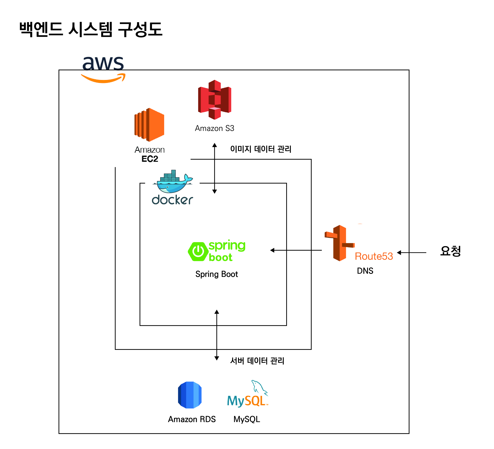
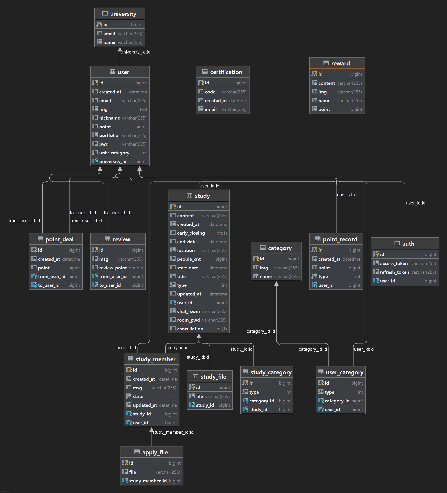

# CAKE - BackEnd

### **[데모영상](https://youtu.be/0SoSCI2tlQE)**

## 프로젝트 설명
대학생들이 같은 학교 학생과 직접 만나 서로의 재능을 교환할 수 있도록 돕는 재능 공유 플랫폼입니다.

### 주요기능
- **스터디 목록**: 우리 학교에서 모집 중인 스터디 목록을 볼 수 있습니다.
- **스터디 상세 보기**: 스터디에 대한 상세 정보를 확인하고, 참여 신청을 보낼 수 있습니다.
- **스터디 만들기**: 스터디를 만들 수 있습니다. 내가 줄 수 있는 것과 받고 싶은 것, 언제 어디에서 스터디를 할 지를 고르고, 스터디에 대해 더 자세한 설명을 할 수도 있습니다.
- **스터디 관리하기**: 내가 만든 스터디나 참여한 스터디 목록을 볼 수 있습니다. 내가 만든 스터디를 신청한 사람들을 관리하거나, 내가 참여한 스터디의 채팅방을 확인할 수 있습니다.
- **스터디 검색하기**: 내가 주고 싶은 것과 받고 싶은 것, 스터디의 형태를 골라서 원하는 스터디를 찾을 수 있습니다.

## 시스템구성도

## ERD

## 기술스택
- SpringBoot 2.5.6: 백엔드 서버 프레임워크
- Spring Data JPA: 자바 진영 ORM 기술 표준
- Spring Security: 어플리케이션의 보안을 담당
- Spring Web: REST API 작성을 위한 도구를 제공
- JUnit5: 테스트 코드 작성 도구
- JWT: 인증/인가 도구로 토큰 방식을 사용
- Google SMTP: 회원가입에서 이메일 인증을 위해 Google SMTP를 사용
- ImgScalr: 이미지 업로드, 다운로드 시, 효율성을 위해 이미지 리사이징 과정을 거침
